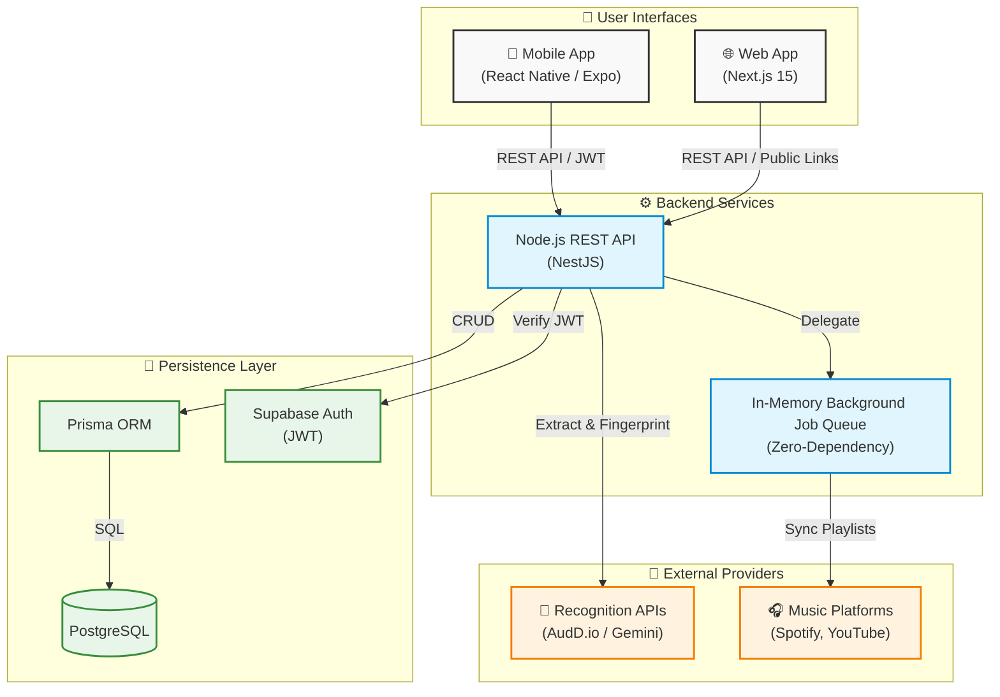

# ReelTune Architecture

ReelTune is designed as a scalable monorepo using pnpm workspaces. The system is split across three main applications (Mobile, Web, API) sharing core configuration and types.

## High-Level Architecture Diagram

## Key Architectural Decisions

1. **Monorepo Structure (`pnpm`)**: Ensures the `packages/types` contract is strongly enforced across the database models, API controllers, and frontend clients. No stale types or disjointed API boundaries.
2. **In-Memory Queue**: To keep costs at $0 during the MVP/Hackathon phase, Redis and BullMQ were removed in favor of a robust in-memory background processor for music platform syncs.
3. **Database Security**: Supabase handles Auth, issuing JWTs. The API (`NestJS`) uses a custom `JwtAuthGuard` to verify these tokens before querying PostgreSQL via Prisma.
4. **Resilient Recognition**: `youtube-dl-exec` runs natively inside the Node environment (supported by Nixpacks in production) to extract raw media URLs. If AudD.io acoustic fingerprinting fails, it gracefully falls back to Google's Gemini 2.5 Flash for multimodal audio analysis.
