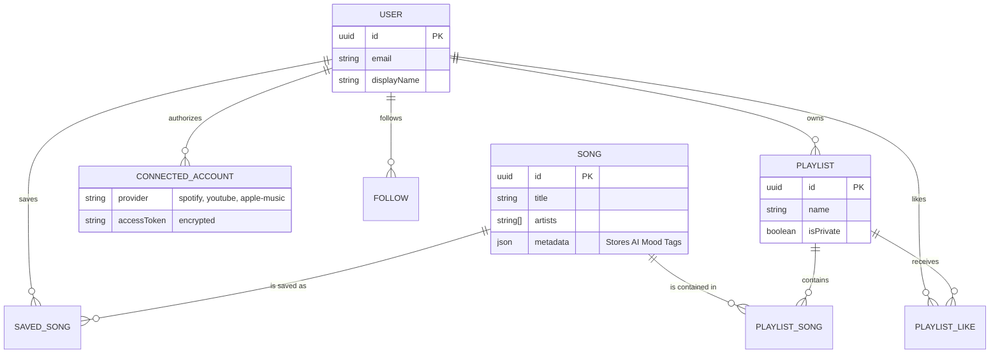

# ReelTune Data Flow

This diagram illustrates how core entities relate to each other and flow through the PostgreSQL database.

## Entity Relationship & Flow

## Security & Data Integrity

1. **Relational Constraints**: Features like duplicate detection are heavily enforced at the database layer (e.g., composite primary keys on `SavedSong` and `PlaylistSong`) avoiding race conditions.
2. **Access Control**: Users can only modify `Playlist` records where `playlist.userId === auth.user.id`.
3. **Public API**: Playlists have a boolean `isPrivate` flag. The web app uses a dedicated public endpoint that strictly enforces this check before rendering shareable links.
4. **Encryption**: `accessToken` strings inside `ConnectedAccount` are encrypted at rest using `TOKEN_ENCRYPTION_KEY` to protect OAuth boundaries.
