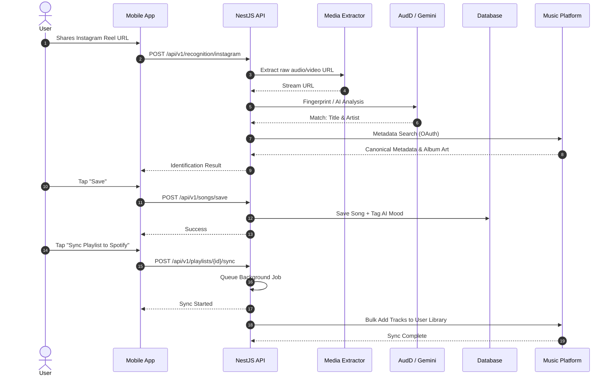

# ReelTune User Journey

This diagram explains the core lifecycle of a song being identified from an Instagram Reel, saved, and eventually synced to an external music library.

## Recognition & Sync Journey

## Smart Features
Along with the standard flow, ReelTune implements passive features like **AI Mood Classification** during the save process, and **Smart Playlist Suggestions** that group similarly tagged songs.
